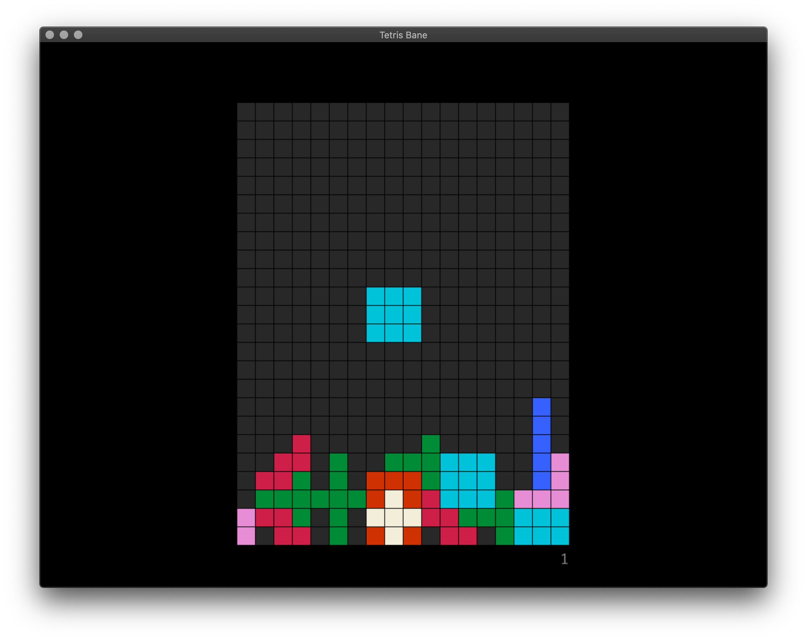

# Tetris Bane

_You'll yearn for the regular tetris blocks._

**Tetris Bane** A Tetris clone with a deliberately frustrating set of blocks. There's also a classic mode for the purists and even a chill mode!

Written in Rust using SDL.



## Requirments

* [Rust development environment](https://www.rust-lang.org/learn/get-started)
* vcpkg is used to manage the dependency on sdl:

```bash
cargo install cargo-vcpkg
cargo vcpkg build
```

## Compile and run

```bash
cargo run --release
```

Enjoy!

## Music Attribution

```
Tetris Metal
By Chris Evans
License: https://creativecommons.org/licenses/by/4.0/

A Very Brady Special by Kevin MacLeod
Link: https://filmmusic.io/song/5760-a-very-brady-special
License: http://creativecommons.org/licenses/by/4.0/

Midnight Tale by Kevin MacLeod
Link: https://incompetech.filmmusic.io/song/4710-midnight-tale
License: http://creativecommons.org/licenses/by/4.0/

Ghost Dance by Kevin MacLeod
Link: https://incompetech.filmmusic.io/song/3802-ghost-dance
License: http://creativecommons.org/licenses/by/4.0/
```

## Win32 notes
Building on windows for release (so the terminal does not open):

```sh
cargo rustc --release -- -Clink-args="/SUBSYSTEM:WINDOWS /ENTRY:mainCRTStartup"
```
